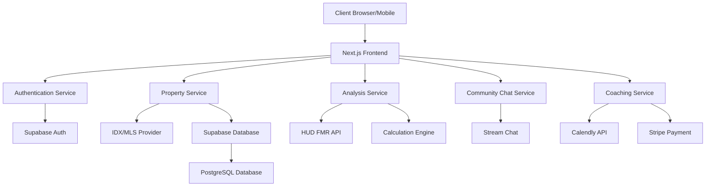

# System Architecture Design

## Implementation Strategy

### Phase 1: Core Platform (Completed)
- Next.js application structure with TypeScript and Tailwind CSS
- Authentication system with Supabase
- Basic property listing functionality
- Simple deal analysis calculations
- UI components and responsive design

### Phase 2: MVP Enhancement (In Progress)
- Enhanced property filters and search capabilities
- Complete FMR data integration with HUD API
- User favorites and saved searches
- Basic community chat implementation
- Initial coaching portal structure

### Phase 3: Advanced Features (Next Focus)
- **Development Tasks:**
  1. Complete IDX integration with real MLS data
  2. Enhance deal analyzer with custom parameters
  3. Build out community features with moderation tools
  4. Implement subscription model for coaching services
  5. Add advanced visualization for property analysis

### Phase 4: Platform Scaling
- Performance optimization for search and filtering
- Enhanced security measures for production
- Comprehensive testing suite and CI/CD pipeline
- Data backup and recovery procedures
- Analytics integration for usage tracking

### Phase 5: Market Expansion
- Additional market data sources
- Mobile application development
- API for third-party integrations
- White-label options for brokerages
